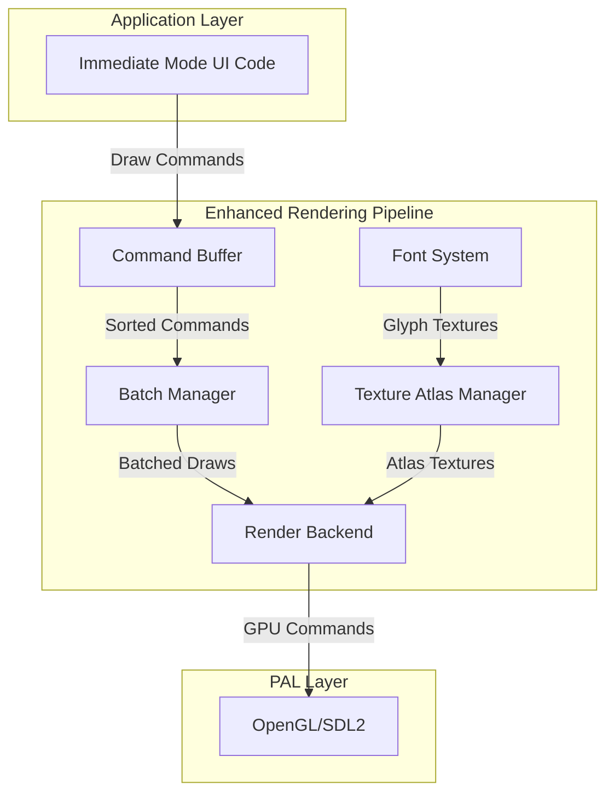

# Enhanced Rendering Pipeline Design for PyramidUI

## Executive Summary

This document outlines the architectural design for enhancing PyramidUI's rendering pipeline with draw call batching, texture atlas management, and font rendering capabilities. The design maintains the framework's immediate-mode philosophy while achieving optimal GPU performance through intelligent batching and resource management.

## 1. Current State Analysis

### 1.1 Existing Architecture
The PyramidUI framework currently uses a Platform Abstraction Layer (PAL) with SDL2/OpenGL backend:

- **Direct Rendering**: Each draw call immediately submits vertices to GPU
- **Simple Vertex Structure**: Position (2D), texture coordinates, color
- **Basic Texture Management**: Individual texture creation/destruction
- **No Batching**: Every `pal_renderer_render_triangles()` call results in a draw call
- **No Font Support**: Text rendering uses placeholder rectangles

### 1.2 Integration Points
Key locations for enhancement integration:
- `pal_renderer_begin_frame()` - Initialize batch state
- `pal_renderer_end_frame()` - Flush remaining batches
- `pal_renderer_render_triangles()` - Intercept for batching
- Texture management functions - Extend for atlas support

## 2. Enhanced Pipeline Architecture

### 2.1 System Overview



### 2.2 Component Responsibilities

#### 2.2.1 Command Buffer
- Stores draw commands during frame construction
- Defers actual rendering until optimization phase
- Supports command sorting by render state

#### 2.2.2 Batch Manager
- Groups similar draw commands
- Minimizes state changes (texture, blend mode, shader)
- Manages dynamic vertex buffer allocation
- Flushes batches when state changes or buffer fills

#### 2.2.3 Texture Atlas Manager
- Packs multiple textures into larger atlases
- Manages atlas allocation and deallocation
- Remaps UV coordinates automatically
- Supports dynamic atlas growth

#### 2.2.4 Font System
- Loads TrueType/OpenType fonts via stb_truetype
- Rasterizes glyphs on-demand
- Manages glyph cache with LRU eviction
- Integrates with texture atlas for glyph storage

## 3. Detailed Component Design

### 3.1 Draw Call Batching

#### 3.1.1 Data Structures

```c
// Draw command types
typedef enum {
    DRAW_CMD_TRIANGLES,
    DRAW_CMD_TEXTURED_QUAD,
    DRAW_CMD_TEXT,
    DRAW_CMD_SET_SCISSOR
} DrawCommandType;

// Render state for sorting/batching
typedef struct {
    PAL_TextureHandle texture;
    uint32_t blend_mode;
    uint32_t shader_program;
    Rect scissor_rect;
} RenderState;

// Individual draw command
typedef struct DrawCommand {
    DrawCommandType type;
    RenderState state;
    uint32_t vertex_offset;
    uint32_t vertex_count;
    union {
        struct {
            PAL_Vertex* vertices;
            size_t count;
        } triangles;
        struct {
            float x, y, w, h;
            float u0, v0, u1, v1;
            Color color;
        } quad;
        struct {
            const char* text;
            float x, y;
            FontHandle font;
            float size;
            Color color;
        } text;
    } data;
} DrawCommand;

// Command buffer for accumulating draw commands
typedef struct CommandBuffer {
    DrawCommand* commands;
    size_t count;
    size_t capacity;
    
    // Vertex data storage
    PAL_Vertex* vertices;
    size_t vertex_count;
    size_t vertex_capacity;
} CommandBuffer;

// Batch for grouped draw commands
typedef struct DrawBatch {
    RenderState state;
    uint32_t vertex_offset;
    uint32_t vertex_count;
    uint32_t command_indices[MAX_BATCH_COMMANDS];
    uint32_t command_count;
} DrawBatch;

// Batch manager
typedef struct BatchManager {
    DrawBatch* batches;
    size_t batch_count;
    size_t batch_capacity;
    
    // Dynamic vertex buffer
    GLuint vbo;
    size_t vbo_size;
    PAL_Vertex* mapped_buffer;
    
    // Statistics
    uint32_t draw_calls_saved;
    uint32_t total_vertices;
} BatchManager;
```

#### 3.1.2 Batching Algorithm

```c
// Pseudo-code for batching algorithm
void batch_manager_build_batches(BatchManager* mgr, CommandBuffer* buffer) {
    // Sort commands by render state
    sort_commands_by_state(buffer->commands, buffer->count);
    
    // Group commands with same state
    DrawBatch* current_batch = NULL;
    for (size_t i = 0; i < buffer->count; i++) {
        DrawCommand* cmd = &buffer->commands[i];
        
        if (!current_batch || !render_states_equal(&current_batch->state, &cmd->state)) {
            // Start new batch
            current_batch = create_new_batch(mgr, &cmd->state);
        }
        
        // Add command to current batch
        add_command_to_batch(current_batch, cmd, i);
        
        // Check if batch is full
        if (current_batch->vertex_count >= MAX_BATCH_VERTICES) {
            current_batch = NULL; // Force new batch on next iteration
        }
    }
}
```

### 3.2 Texture Atlas System

#### 3.2.1 Data Structures

```c
// Rectangle in atlas
typedef struct AtlasRect {
    uint16_t x, y, width, height;
} AtlasRect;

// Node for binary tree packing
typedef struct AtlasNode {
    AtlasRect rect;
    struct AtlasNode* left;
    struct AtlasNode* right;
    bool occupied;
    uint32_t texture_id;
} AtlasNode;

// Individual texture atlas
typedef struct TextureAtlas {
    GLuint gl_texture;
    uint32_t width;
    uint32_t height;
    AtlasNode* root;
    
    // Texture lookup
    struct {
        uint32_t texture_id;
        AtlasRect rect;
        float u0, v0, u1, v1; // Normalized UV coords
    }* entries;
    size_t entry_count;
    size_t entry_capacity;
    
    // Usage statistics
    uint32_t used_pixels;
    uint32_t total_pixels;
} TextureAtlas;

// Atlas manager
typedef struct AtlasManager {
    TextureAtlas** atlases;
    size_t atlas_count;
    size_t atlas_capacity;
    
    // Configuration
    uint32_t max_atlas_size;
    uint32_t default_atlas_size;
    
    // ID generation
    uint32_t next_texture_id;
    
    // Statistics
    uint32_t total_textures;
    float average_occupancy;
} AtlasManager;
```

#### 3.2.2 Packing Algorithm

```c
// Binary tree rectangle packing
AtlasNode* atlas_pack_texture(TextureAtlas* atlas, uint32_t width, uint32_t height, uint32_t texture_id) {
    return pack_recursive(atlas->root, width, height, texture_id);
}

AtlasNode* pack_recursive(AtlasNode* node, uint32_t w, uint32_t h, uint32_t id) {
    if (node->left && node->right) {
        // Try packing in left subtree
        AtlasNode* result = pack_recursive(node->left, w, h, id);
        if (result) return result;
        
        // Try packing in right subtree
        return pack_recursive(node->right, w, h, id);
    }
    
    // Leaf node
    if (node->occupied) return NULL;
    
    // Check if texture fits
    if (w > node->rect.width || h > node->rect.height) return NULL;
    
    // Perfect fit
    if (w == node->rect.width && h == node->rect.height) {
        node->occupied = true;
        node->texture_id = id;
        return node;
    }
    
    // Split node
    node->left = create_node();
    node->right = create_node();
    
    // Decide split direction
    int dw = node->rect.width - w;
    int dh = node->rect.height - h;
    
    if (dw > dh) {
        // Vertical split
        node->left->rect = (AtlasRect){node->rect.x, node->rect.y, w, node->rect.height};
        node->right->rect = (AtlasRect){node->rect.x + w, node->rect.y, dw, node->rect.height};
    } else {
        // Horizontal split
        node->left->rect = (AtlasRect){node->rect.x, node->rect.y, node->rect.width, h};
        node->right->rect = (AtlasRect){node->rect.x, node->rect.y + h, node->rect.width, dh};
    }
    
    // Pack in left child
    return pack_recursive(node->left, w, h, id);
}
```

### 3.3 Font Rendering System

#### 3.3.1 Data Structures

```c
// Font glyph information
typedef struct Glyph {
    uint32_t codepoint;
    
    // Metrics
    int advance_x;
    int left_bearing;
    int top_bearing;
    int width;
    int height;
    
    // Atlas location
    uint32_t atlas_id;
    float u0, v0, u1, v1;
    
    // Cache management
    uint32_t last_used_frame;
    struct Glyph* lru_prev;
    struct Glyph* lru_next;
} Glyph;

// Font face
typedef struct Font {
    // stb_truetype data
    stbtt_fontinfo stb_font;
    unsigned char* font_data;
    
    // Font metrics
    float scale;
    int ascent;
    int descent;
    int line_gap;
    
    // Glyph cache (hash table)
    Glyph** glyph_cache;
    size_t cache_size;
    
    // LRU list for cache eviction
    Glyph* lru_head;
    Glyph* lru_tail;
    
    // Kerning cache
    struct {
        uint64_t pair; // (codepoint1 << 32) | codepoint2
        int kern;
    }* kern_cache;
    size_t kern_cache_size;
} Font;

// Font manager
typedef struct FontManager {
    Font** fonts;
    size_t font_count;
    size_t font_capacity;
    
    // Shared glyph atlas
    AtlasManager* glyph_atlas;
    
    // Rasterization buffer
    unsigned char* raster_buffer;
    size_t raster_buffer_size;
    
    // Default font
    FontHandle default_font;
} FontManager;

// Text layout information
typedef struct TextLayout {
    struct {
        Glyph* glyph;
        float x, y;
        Color color;
    }* glyphs;
    size_t glyph_count;
    
    float width;
    float height;
    float baseline;
} TextLayout;
```

#### 3.3.2 Glyph Rasterization and Caching

```c
Glyph* font_get_glyph(Font* font, uint32_t codepoint, float size) {
    // Check cache
    uint32_t hash = hash_codepoint(codepoint, size);
    Glyph* glyph = font->glyph_cache[hash % font->cache_size];
    
    if (glyph && glyph->codepoint == codepoint) {
        // Move to front of LRU
        lru_touch(font, glyph);
        return glyph;
    }
    
    // Rasterize glyph
    glyph = rasterize_glyph(font, codepoint, size);
    
    // Add to atlas
    AtlasRect rect = atlas_manager_add_texture(
        font_manager->glyph_atlas,
        glyph->width,
        glyph->height,
        glyph->bitmap_data
    );
    
    // Update glyph UV coordinates
    glyph->u0 = rect.x / (float)atlas_width;
    glyph->v0 = rect.y / (float)atlas_height;
    glyph->u1 = (rect.x + rect.width) / (float)atlas_width;
    glyph->v1 = (rect.y + rect.height) / (float)atlas_height;
    
    // Add to cache
    add_to_cache(font, glyph, hash);
    
    return glyph;
}

Glyph* rasterize_glyph(Font* font, uint32_t codepoint, float size) {
    // Get glyph metrics
    int glyph_index = stbtt_FindGlyphIndex(&font->stb_font, codepoint);
    
    int advance, lsb;
    stbtt_GetGlyphHMetrics(&font->stb_font, glyph_index, &advance, &lsb);
    
    // Get glyph bitmap
    int w, h, xoff, yoff;
    float scale = stbtt_ScaleForPixelHeight(&font->stb_font, size);
    unsigned char* bitmap = stbtt_GetGlyphBitmap(
        &font->stb_font, scale, scale,
        glyph_index, &w, &h, &xoff, &yoff
    );
    
    // Create glyph structure
    Glyph* glyph = malloc(sizeof(Glyph));
    glyph->codepoint = codepoint;
    glyph->width = w;
    glyph->height = h;
    glyph->left_bearing = xoff;
    glyph->top_bearing = yoff;
    glyph->advance_x = (int)(advance * scale);
    glyph->bitmap_data = bitmap;
    
    return glyph;
}
```

## 4. API Specifications

### 4.1 Batch Manager API

```c
// Initialization
BatchManager* batch_manager_create(size_t initial_vertex_capacity);
void batch_manager_destroy(BatchManager* mgr);

// Frame operations
void batch_manager_begin_frame(BatchManager* mgr);
void batch_manager_end_frame(BatchManager* mgr);

// Command submission
void batch_manager_submit_triangles(BatchManager* mgr, PAL_TextureHandle texture, 
                                   const PAL_Vertex* vertices, size_t count);
void batch_manager_submit_quad(BatchManager* mgr, PAL_TextureHandle texture,
                              float x, float y, float w, float h,
                              float u0, float v0, float u1, float v1, Color color);
void batch_manager_submit_text(BatchManager* mgr, FontHandle font,
                              const char* text, float x, float y, 
                              float size, Color color);

// Rendering
void batch_manager_flush(BatchManager* mgr, PAL_Renderer* renderer);

// Statistics
BatchStats batch_manager_get_stats(const BatchManager* mgr);
```

### 4.2 Atlas Manager API

```c
// Initialization
AtlasManager* atlas_manager_create(uint32_t max_size, uint32_t default_size);
void atlas_manager_destroy(AtlasManager* mgr);

// Texture management
uint32_t atlas_manager_add_texture(AtlasManager* mgr, 
                                  uint32_t width, uint32_t height,
                                  const void* data);
void atlas_manager_remove_texture(AtlasManager* mgr, uint32_t texture_id);
bool atlas_manager_get_uv(AtlasManager* mgr, uint32_t texture_id,
                         float* u0, float* v0, float* u1, float* v1);

// Atlas access
PAL_TextureHandle atlas_manager_get_atlas_texture(AtlasManager* mgr, uint32_t atlas_index);
size_t atlas_manager_get_atlas_count(const AtlasManager* mgr);

// Optimization
void atlas_manager_defragment(AtlasManager* mgr);
AtlasStats atlas_manager_get_stats(const AtlasManager* mgr);
```

### 4.3 Font Manager API

```c
// Initialization
FontManager* font_manager_create(AtlasManager* atlas);
void font_manager_destroy(FontManager* mgr);

// Font loading
FontHandle font_manager_load_font(FontManager* mgr, const char* path);
FontHandle font_manager_load_font_from_memory(FontManager* mgr, 
                                             const void* data, size_t size);
void font_manager_unload_font(FontManager* mgr, FontHandle font);

// Text rendering
TextLayout* font_manager_layout_text(FontManager* mgr, FontHandle font,
                                    const char* text, float size);
void font_manager_render_text(FontManager* mgr, BatchManager* batch,
                             FontHandle font, const char* text,
                             float x, float y, float size, Color color);

// Metrics
int font_manager_get_text_width(FontManager* mgr, FontHandle font,
                               const char* text, float size);
int font_manager_get_font_height(FontManager* mgr, FontHandle font, float size);

// Cache management
void font_manager_clear_cache(FontManager* mgr);
void font_manager_set_cache_size(FontManager* mgr, size_t max_glyphs);
```

## 5. Integration with Existing PAL Layer

### 5.1 Modified PAL Renderer Structure

```c
struct PAL_Renderer {
    // Existing fields
    PAL_Window* pal_window;
    SDL_GLContext gl_context;
    GLuint shader_program;
    GLuint vao;
    GLuint vbo;
    GLuint default_texture;
    GLint proj_matrix_location;
    GLint texture_sampler_location;
    int window_width;
    int window_height;
    
    // New fields for enhanced pipeline
    BatchManager* batch_manager;
    AtlasManager* atlas_manager;
    FontManager* font_manager;
    CommandBuffer* command_buffer;
    
    // Configuration flags
    bool batching_enabled;
    bool atlas_enabled;
    size_t max_vertices_per_batch;
};
```

### 5.2 Modified Rendering Flow

```c
void pal_renderer_begin_frame(PAL_Renderer* renderer, Color clear_color) {
    // Existing clear operations
    SDL_GL_MakeCurrent(renderer->pal_window->sdl_window, renderer->gl_context);
    glClearColor(clear_color.r / 255.0f, clear_color.g / 255.0f, 
                clear_color.b / 255.0f, clear_color.a / 255.0f);
    glClear(GL_COLOR_BUFFER_BIT);
    
    // Initialize batching for new frame
    if (renderer->batching_enabled) {
        batch_manager_begin_frame(renderer->batch_manager);
        command_buffer_clear(renderer->command_buffer);
    }
}

void pal_renderer_render_triangles(PAL_Renderer* renderer, PAL_TextureHandle texture,
                                  const PAL_Vertex* vertices, size_t vertex_count) {
    if (renderer->batching_enabled) {
        // Submit to batch manager instead of immediate rendering
        batch_manager_submit_triangles(renderer->batch_manager, texture, vertices, vertex_count);
    } else {
        // Existing immediate rendering
        pal_renderer_render_triangles_immediate(renderer, texture, vertices, vertex_count);
    }
}

void pal_renderer_end_frame(PAL_Renderer* renderer) {
    // Flush batched commands
    if (renderer->batching_enabled) {
        batch_manager_flush(renderer->batch_manager, renderer);
    }
    
    // Swap buffers
    SDL_GL_SwapWindow(renderer->pal_window->sdl_window);
    
    // Update statistics
    if (renderer->batching_enabled) {
        batch_manager_end_frame(renderer->batch_manager);
    }
}
```

## 6. Performance Optimizations

### 6.1 Draw Call Reduction Strategies

1. **State Sorting Priority**:
   - Primary: Texture/Atlas ID
   - Secondary: Blend mode
   - Tertiary: Shader program
   - Quaternary: Scissor rectangle

2. **Vertex Buffer Management**:
   - Use persistent mapped buffers (GL_MAP_PERSISTENT_BIT)
   - Triple buffering for CPU/GPU parallelism
   - Growing buffer strategy with geometric expansion

3. **Command Buffer Optimization**:
   - Pre-allocate based on previous frame statistics
   - Use memory pools for command allocation
   - Implement command compression for repeated patterns

### 6.2 Texture Atlas Optimization

1. **Atlas Generation Strategy**:
   - Start with 512x512, expand to 2048x2048 as needed
   - Group textures by usage frequency
   - Separate static and dynamic atlases

2. **Packing Efficiency**:
   - Use shelf packing for initial layout
   - Binary tree for dynamic additions
   - Periodically rebuild atlases to reduce fragmentation

3. **Memory Management**:
   - Lazy atlas creation
   - Automatic atlas consolidation when occupancy drops below 50%
   - LRU eviction for rarely used textures

### 6.3 Font Rendering Optimization

1. **Glyph Cache Strategy**:
   - Pre-render ASCII characters on font load
   - Use separate atlases for different font sizes
   - Implement distance field fonts for scalable text

2. **Text Layout Caching**:
   - Cache laid out text for static strings
   - Reuse layout calculations for repeated text
   - Batch text rendering by font and size

## 7. Implementation Plan

### 7.1 Phase 1: Command Buffer and Basic Batching
**Duration**: 1 week
**Dependencies**: None

1. Implement CommandBuffer structure
2. Create basic DrawCommand types
3. Modify PAL renderer to use command buffer
4. Implement simple batching without sorting

**Deliverables**:
- `command_buffer.h/c`
- Modified `pal_sdl_renderer.c`
- Basic batching tests

### 7.2 Phase 2: Advanced Batching with State Sorting
**Duration**: 1 week
**Dependencies**: Phase 1

1. Implement RenderState comparison
2. Add command sorting algorithm
3. Implement batch building with state changes
4. Add vertex buffer management

**Deliverables**:
- `batch_manager.h/c`
- Sorting algorithms
- Performance benchmarks

### 7.3 Phase 3: Texture Atlas System
**Duration**: 2 weeks
**Dependencies**: Phase 2

1. Implement AtlasNode and packing algorithm
2. Create TextureAtlas management
3. Integrate with batch manager
4. Add UV coordinate remapping

**Deliverables**:
- `atlas_manager.h/c`
- `atlas_packer.h/c`
- Atlas visualization tools

### 7.4 Phase 4: Font System Foundation
**Duration**: 1 week
**Dependencies**: Phase 3

1. Integrate stb_truetype
2. Implement basic font loading
3. Create glyph rasterization
4. Add simple text rendering

**Deliverables**:
- `font_manager.h/c`
- `font_loader.h/c`
- Basic font tests

### 7.5 Phase 5: Advanced Font Features
**Duration**: 1 week
**Dependencies**: Phase 4

1. Implement glyph caching with LRU
2. Add kerning support
3. Implement text layout engine
4. Add text shaping for complex scripts

**Deliverables**:
- `text_layout.h/c`
- `glyph_cache.h/c`
- Multi-language tests

### 7.6 Phase 6: Integration and Optimization
**Duration**: 1 week
**Dependencies**: All phases

1. Full integration with PyramidUI
2. Performance profiling and optimization
3. Memory usage optimization
4. Documentation and examples

**Deliverables**:
- Integrated system
- Performance reports
- Usage documentation

## 8. Testing Strategy

### 8.1 Unit Tests
- Command buffer operations
- Batch building logic
- Atlas packing algorithm
- Glyph cache management

### 8.2 Integration Tests
- Render output validation
- State change handling
- Atlas overflow scenarios
- Font fallback chains

### 8.3 Performance Tests
- Draw call reduction metrics
- Frame time measurements
- Memory usage profiling
- Cache hit rates

### 8.4 Stress Tests
- Maximum vertices per frame
- Atlas fragmentation over time
- Glyph cache thrashing
- Rapid state changes

## 9. Migration Guide

### 9.1 Enabling Enhanced Pipeline

```c
// Create renderer with enhanced features
PAL_RendererConfig config = {
    .enable_batching = true,
    .enable_atlas = true,
    .max_vertices_per_batch = 65536,
    .atlas_size = 2048,
    .font_cache_size = 1024
};
PAL_Renderer* renderer = pal_renderer_create_ex(window, &config);
```

### 9.2 Using Text Rendering

```c
// Load font
FontHandle font = pal_renderer_load_font(renderer, "assets/fonts/roboto.ttf");

// Render text with new API
pal_renderer_draw_text(renderer, font, "Hello, World!", 100, 100, 24, COLOR_WHITE);
```

### 9.3 Texture Atlas Usage

```c
// Textures automatically added to atlas
PAL_TextureHandle tex = pal_renderer_create_texture(renderer, width, height, data);

// Use texture normally - UV coordinates automatically remapped
pal_renderer_render_textured_quad(renderer, tex, x, y, w, h, 0, 0, 1, 1, COLOR_WHITE);
```

## 10. Future Enhancements

### 10.1 Short Term (3-6 months)
- Instanced rendering for repeated elements
- Compute shader integration for UI effects
- SDF (Signed Distance Field) font rendering
- Gradient and pattern fill support

### 10.2 Long Term (6-12 months)
- Vulkan backend implementation
- Multi-threaded command generation
- GPU-driven rendering pipeline
- Advanced text shaping with HarfBuzz
- Vector graphics rendering

## Appendix A: Configuration Parameters

```c
// Recommended default values
#define DEFAULT_BATCH_SIZE          4096    // vertices
#define MAX_BATCH_SIZE              65536   // vertices
#define DEFAULT_ATLAS_SIZE          1024    // pixels
#define MAX_ATLAS_SIZE              4096    // pixels
#define DEFAULT_GLYPH_CACHE_SIZE    256     // glyphs
#define MAX_GLYPH_CACHE_SIZE        2048    // glyphs
#define ATLAS_PADDING               2        // pixels between textures
#define MIN_ATLAS_OCCUPANCY         0.5     // 50% before defrag
```

## Appendix B: Performance Metrics

Expected improvements with enhanced pipeline:

| Metric | Current | Enhanced | Improvement |
|--------|---------|----------|-------------|
| Draw Calls (typical frame) | 100-500 | 5-20 | 80-95% reduction |
| Vertex Uploads | Every call | Once per batch | 90% reduction |
| Texture Binds | Every quad | Per atlas | 85% reduction |
| Frame Time (1000 widgets) | 16ms | 4ms | 75% reduction |
| Memory Usage | Baseline | +2-4MB | Acceptable overhead |

## Conclusion

This enhanced rendering pipeline design provides PyramidUI with a modern, efficient rendering system while maintaining its immediate-mode philosophy. The modular architecture allows for incremental implementation and testing, ensuring stability throughout the development process. The design prioritizes performance through intelligent batching and resource management while keeping the API simple and intuitive for framework users.