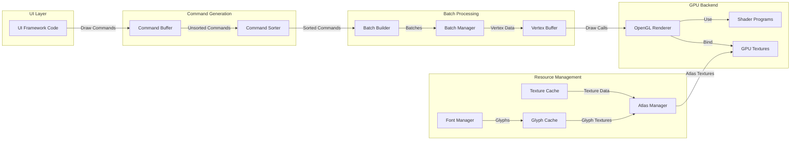
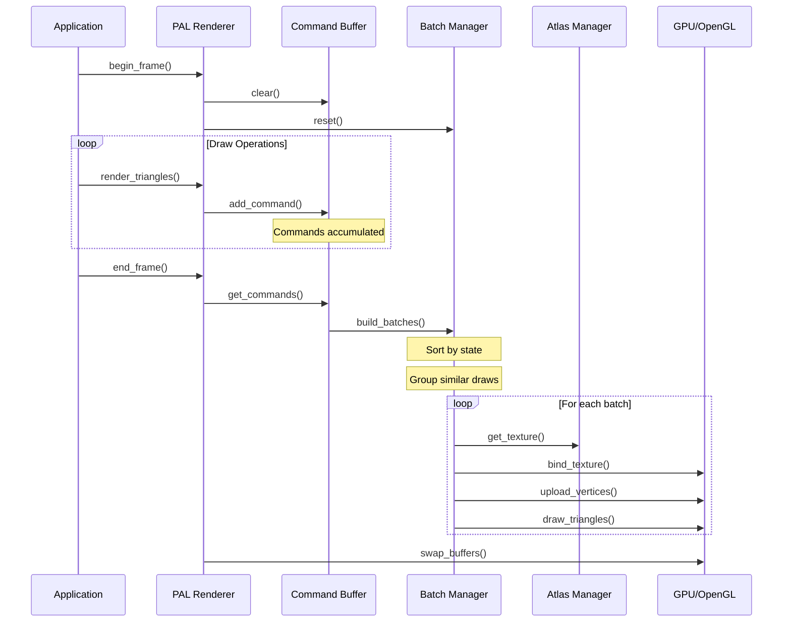
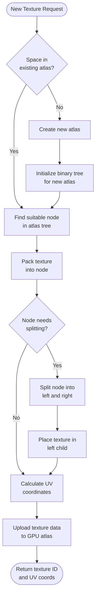
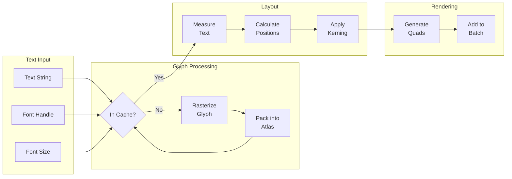
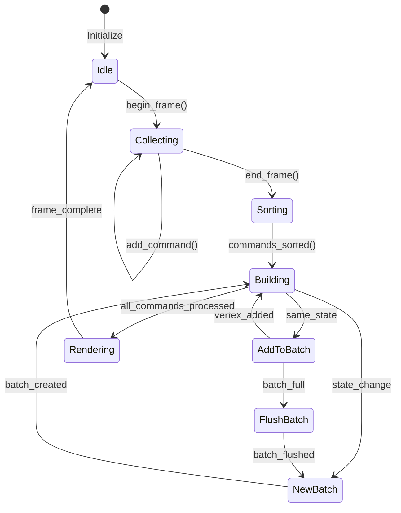
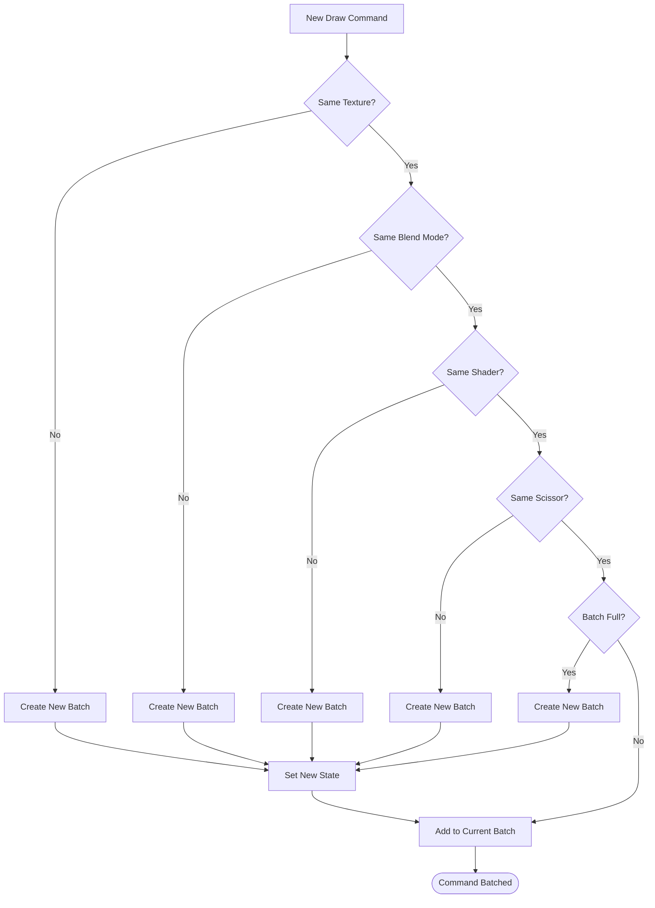
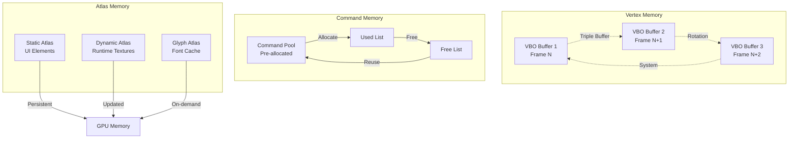
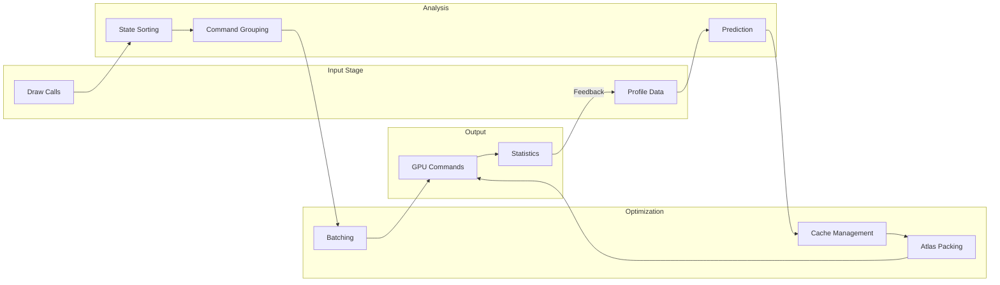
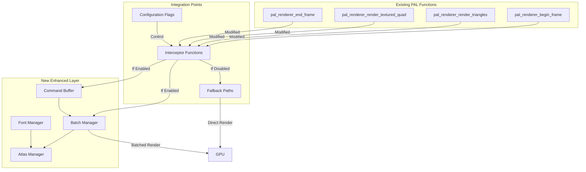

# Enhanced Rendering Pipeline - Architecture Diagrams

## 1. System Component Interaction



## 2. Frame Execution Flow



## 3. Texture Atlas Packing Process



## 4. Font Rendering Pipeline



## 5. Batch Building State Machine



## 6. Draw Command Batching Decision Tree



## 7. Memory Management Strategy



## 8. Performance Optimization Flow



## 9. Integration Points with Existing PAL



## 10. Module Dependencies

```mermaid
graph BT
    subgraph "Core Dependencies"
        STB[stb_truetype.h]
        GL[OpenGL/GLAD]
        SDL[SDL2]
    end
    
    subgraph "Base Modules"
        VTX[Vertex Management]
        TEX[Texture Management]
        SHD[Shader Management]
    end
    
    subgraph "Enhanced Modules"
        CMD[Command Buffer]
        SORT[Command Sorter]
        BATCH[Batch Manager]
        ATLAS[Atlas Manager]
        FONT[Font Manager]
    end
    
    subgraph "PAL Integration"
        PAL[PAL Renderer]
    end
    
    STB --> FONT
    GL --> VTX
    GL --> TEX
    GL --> SHD
    SDL --> PAL
    
    VTX --> BATCH
    TEX --> ATLAS
    SHD --> PAL
    
    CMD --> SORT
    SORT --> BATCH
    BATCH --> PAL
    ATLAS --> PAL
    FONT --> ATLAS
    FONT --> PAL